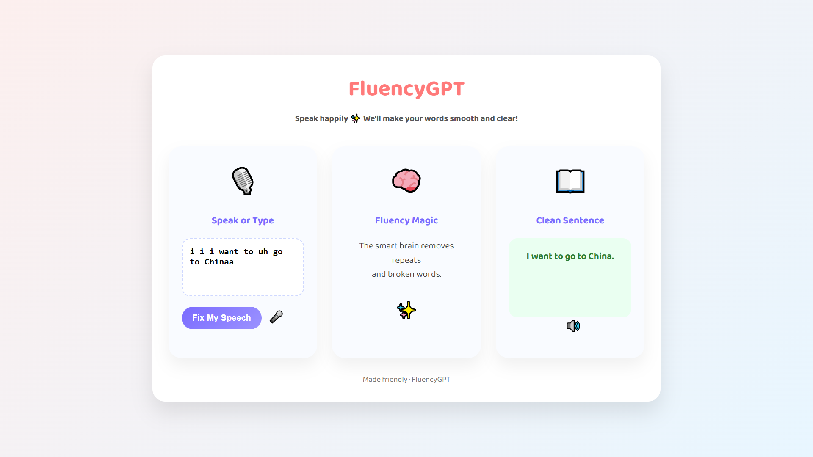

# FluencyGPT Backend

[](https://www.python.org/)
[](https://flask.palletsprojects.com/)
[](https://docs.pytest.org/)
[](LICENSE)

Production-ready Flask backend for FluencyGPT, focused on automatic stuttering correction with a reliable offline-first architecture.

The system supports:
- deterministic, rule-based disfluency processing for stable offline demos
- optional OpenRouter LLM rewriting for stronger fluency polishing
- optional ASR pipeline via SpeechRecognition when online mode is enabled

## UI Preview



## What This Project Does

FluencyGPT processes user input in two modes:
1. Text mode: disfluency detection followed by fluent rewrite
2. Voice mode: audio transcription, then detection and rewrite

Target disfluency patterns include:
- filler words like um, uh, er
- immediate repetitions like I I want
- broken starts like t t to and b-b-because
- prolonged sounds like sssorry

## Core Features

- Health endpoint for uptime checks
- Disfluency detector with span-level structured output
- Fluency rewriter with rule-based baseline and LLM enhancement path
- Unified pipeline endpoint that accepts either JSON text or multipart audio
- Voice endpoint for end-to-end ASR plus fluency rewrite
- Offline-safe defaults for predictable demos

## Architecture Overview

```text
Client (UI / API caller)
    |
    +--> /detect  ------> Rule-based Disfluency Detector
    |
    +--> /rewrite -----> Rule-based Rewriter ----+--> Response
    |                                            |
    |                                            +--> OpenRouter LLM (optional)
    |
    +--> /pipeline or /voice
             |
             +--> ASR Service (optional online)
             +--> Detector
             +--> Rewriter (LLM with rule fallback)
```

## Tech Stack

- Python 3.10+
- Flask backend
- SpeechRecognition for ASR
- python-dotenv for configuration
- Waitress option for production-style serving
- pytest for tests

## Project Structure

```text
src/fluencygpt/
  app.py                 # Flask app factory
  __main__.py            # Entrypoint: python -m fluencygpt
  config.py              # Environment-backed settings
  routes/
    api.py               # /health, /asr, /detect, /rewrite, /pipeline, /voice
    voice.py             # /process-audio
  services/
    asr_service.py       # Audio decoding, conversion, transcription
    disfluency_service.py# Rule-based detection engine
    rewrite_service.py   # Rule-based + OpenRouter rewrite path
  utils/
    http.py              # JSON error helpers
    text.py              # Text normalization helpers
tests/
  test_*.py              # Endpoint and service behavior tests
```

## Quick Start (Windows)

### 1. Create virtual environment and install dependencies

```powershell
cd c:\Projects\FluencyGPT
python -m venv .venv
.\.venv\Scripts\Activate.ps1
pip install -r requirements.txt
```

### 2. Configure environment

No API keys are needed for offline rule-based mode.

Optional .env values:

```env
HOST=127.0.0.1
PORT=5000
MAX_UPLOAD_BYTES=26214400
ENABLE_ONLINE_ASR=0
OPENROUTER_API_KEY=your-key
OPENROUTER_MODEL=openai/gpt-4o-mini
```

### 3. Run server

```powershell
./run_dev.ps1
```

Alternative:

```powershell
python -m fluencygpt
```

Production-style serving:

```powershell
python -m fluencygpt --serve waitress
```

## API Reference

| Method | Endpoint | Purpose | Default Mode |
|---|---|---|---|
| GET | /health | Service health check | Offline |
| POST | /asr | Audio to transcript | Disabled unless ENABLE_ONLINE_ASR=1 |
| POST | /detect | Detect disfluency spans from text | Offline |
| POST | /rewrite | Fluency rewrite from text | Offline baseline, LLM optional |
| POST | /pipeline | Full pipeline from text or audio | Offline for text path |
| POST | /voice | Audio to fluent text pipeline | Disabled unless ENABLE_ONLINE_ASR=1 |
| POST | /process-audio | Voice-focused end-to-end route | Disabled unless ENABLE_ONLINE_ASR=1 |

## API Usage Examples

### Health

```bash
curl http://127.0.0.1:5000/health
```

### Detect

```bash
curl -X POST http://127.0.0.1:5000/detect \
  -H "Content-Type: application/json" \
  -d "{\"text\":\"I I I want to um go to the store\"}"
```

### Rewrite

```powershell
Invoke-WebRequest `
  -Uri http://127.0.0.1:5000/rewrite `
  -Method POST `
  -Headers @{ "Content-Type" = "application/json" } `
  -Body '{ "text": "I I I want to um go to the store" }'
```

### Pipeline (offline text path)

```powershell
Invoke-WebRequest `
  -Uri http://127.0.0.1:5000/pipeline `
  -Method POST `
  -Headers @{ "Content-Type" = "application/json" } `
  -Body '{ "text": "I I I want t t to go home" }'
```

### Voice (online ASR required)

```powershell
$env:ENABLE_ONLINE_ASR = "1"
curl.exe -X POST http://127.0.0.1:5000/voice -F "audio=@sample.wav"
```

## ASR and Audio Notes

- ASR uses SpeechRecognition with Google recognizer when enabled
- WAV PCM is the most reliable input format
- WebM, OGG, MP3, and M4A are supported through ffmpeg conversion if ffmpeg is installed
- Without ENABLE_ONLINE_ASR=1, ASR endpoints are intentionally restricted for offline safety

## Security and Secret Management

- Keep secrets in local .env only
- Never commit real API keys
- .env is ignored through .gitignore
- Use .env.example as a safe template for collaborators

## Testing

Run all tests:

```powershell
./run_tests.ps1
```

Or directly:

```powershell
python -m pytest -q
```

## License

MIT

